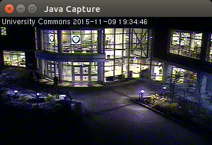
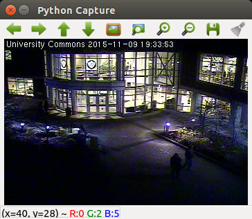
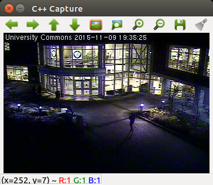
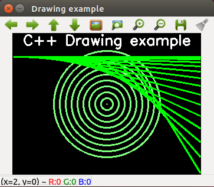

If you are interested in compiling the latest version of OpenCV for ARM based SBCs or x86 computers then this project will show you how. You should be experienced with Linux, OpenCV and Python to make the most of this project. I have created a set of scripts that automate the install process. The scripts support Ubuntu 16.04, Debian GNU/Linux 8 (jessie) and probably other distributions. x86, x86_64, ARMV7 and ARMV8 are currently working. I'm trying to hardware optimize on the platforms I'm testing which are CHIP and Pine64 right now.


The image above is a screenshot of a video frame that has been processed by [motiondetect.py](https://github.com/sgjava/install-opencv/blob/master/opencv-python/codeferm/motiondetect.py). Motion is bounded by green boxes and pedestrians by blue boxes.

You have to optimize extensively on platforms with an incompatible VPU/GPU such as the Mali 400. The [CHIP](https://getchip.com/pages/chip) SBC only has one CPU core, but you can do real time object detection using techniques I'll describe later on. These methods will scale nicely on multi-core SBCs and x86 computers. The extra processing time on multi-core systems can be leveraged for milti-detection or other processing.

* [Provides](#provides)
* [Test Camera](#test-camera)
* [Download project](#download-project)
* [Install The Whole Enchilada](#install-the-whole-enchilada)
* [Install Java and Ant](#install-java-and-ant)
* [Install libjpeg-turbo](#install-libjpeg-turbo)
* [Install mjpg-streamer](#install-mjpg-streamer)
* [Install OpenCV](#install-opencv)
* [Motion Detection](#motion-detection)
    * [Boosting Performance](#boosting-performance)
    * [Run Motion Detection](#run-motion-detection)
* [Java](#java)
* [Python](#python)
* [C++](#c)  
* [References](#references)
* [FreeBSD License](#freebsd-license)

###Provides
* Latest Oracle JDK 8 and Apache Ant
    * FourCC class
    * CaptureUI Applet to view images/video since there's no imshow with the bindings
* Latest libjpeg-turbo optimized for SIMD
    * Patch to mute common warnings that will fill up the logs
* Latest mjpg-streamer (10/27/2013 last commit) optimized with libjpeg-turbo
* Latest OpenCV with opencv_contrib optimized for libjpeg-turbo
    * Patch memory leaks as I find them. Get more information [here](https://github.com/sgjava/opencvmem)
* Python application provides motion, pedestrian (HOG) and Haar Cascade detection
* Java, Python and C++ examples can be easily run from Eclipse.
    * Capture UI
    * Motion detection
    * People detection
    * Camera Calibration
    * Drawing

###Test Camera
If you plan on processing only video or image files then you can skip this section. Live video will allow you to create smart camera applications that react to a live video stream (versus a streaming only camera). You will need to select a USB camera that works under [Linux](http://elinux.org/RPi_USB_Webcams) and has the proper resolution.
* Add user to video group
    * `sudo usermod -a -G video username`
* Install uvcdynctrl v4l-utils
    * `sudo apt-get install uvcdynctrl v4l-utils`
* Reboot
    * `sudo reboot`
* Get camera information (using a cheap Kinobo Origami Webcam here for illustration)
    * `lsusb`
         * `Bus 003 Device 002: ID 1871:0142 Aveo Technology Corp.`
    * `uvcdynctrl -f`
         * `Pixel format: YUYV (YUYV 4:2:2; MIME type: video/x-raw-yuv)`
    * `v4l2-ctl --list-formats-ext`

###Download project
* `sudo apt-get install git-core`
* `cd ~/`
* `git clone --depth 1 https://github.com/sgjava/install-opencv.git`
* On ARM platforms with limited memory create a swap file or the build may fail
with an out of memory exception. To create a 1GB swap file use:
    * `sudo su -`
    * `dd if=/dev/zero of=tmpswap bs=1024 count=1M`
    * `mkswap tmpswap`
    * `swapon tmpswap`
    * `free`

###Install The Whole Enchilada
This is probably the easiest way to install everything, but you can follow the individual steps below to build or rebuild individual components. There are values you can change in the individual scripts, so read them over. Skip the rest of the individual scripts below if you run this.
* `cd ~/install-opencv/scripts`
* Edit `config.sh` and make changes as needed
* `sudo nohup ./install.sh &`
    * Use `top` to monitor until build completes

###Install Java and Ant
* `cd ~/install-opencv/scripts`
* `sudo ./install-java.sh`
* `java -version`
* `ant -version`

###Install libjpeg-turbo
Patches jdhuff.c to remove "Invalid SOS parameters for sequential JPEG" warning and jdmarker.c to remove "Corrupt JPEG data: xx extraneous bytes before marker 0xd9" warning. These will fill up the logs if not muted.
* `cd ~/install-opencv/scripts`
* `sudo nohup ./install-libjpeg-turbo.sh &`
    * Use `top` to monitor until build completes

###Install mjpg-streamer
Sometimes all you need is a live video feed without further processing. This section will be what you are looking for. It also makes sense to move the UVC processing into a different Linux process or thread from the main CV code.

####WARNING
I'm running this on a test LAN and not securing mjpg-streamer. In production you will want to use a user and password with mjpg-streamer. You will also want to put it behind a secure proxy if you are accessing it from the Internet.

Change `whitepatch` in `install-mjpg-streamer.sh` to `True` if you get a white image. I had to set this to True for using MPJEG mode. In YUYV I set it to `False`. The default setting is `True`.

* `cd ~/install-opencv/scripts`
* `sudo sh install-mjpg-streamer.sh`
    * Runtime ~3 minutes
* `v4l2-ctl --list-formats`
    * Check Pixel Format for 'YUYV' and/or 'MJPG'
* To run mjpg-streamer with 'YUYV' only camera use
    * `mjpg_streamer -i "/usr/local/lib/input_uvc.so -y" -o "/usr/local/lib/output_http.so -w /usr/local/www"`
* To run mjpg-streamer with 'MJPG' use
    * `mjpg_streamer -i "/usr/local/lib/input_uvc.so" -o "/usr/local/lib/output_http.so -w /usr/local/www"`
* In your web browser or VLC player go to `http://yourhost:8080/?action=stream` and you should see the video stream.

###Install OpenCV
I have included a Java patch that is disabled by default. The patch will fix memory leaks and performance issues with Java. See [OpenCV Java memory management](https://github.com/sgjava/opencvmem) for details.
* `cd ~/install-opencv/scripts`
* `sudo rm nohup.out`
* `sudo nohup ./install-opencv.sh &`
    * Use `top` to monitor until build completes

###Motion Detection
This is a good first example into the foray that is Computer Vision. This is also a practical example that you can use as the basis for other CV projects. From experience I can tell you that you need to understand the usage scenario. Simple motion detection will work well with static backgrounds, but using it outside you have to deal with cars, tree branches blowing, sudden light changes, etc. This is why built in motion detection is mostly useless on security cameras for these types of scenarios. You can use ignore bitmaps and ROI (regions of interest) to improve results with dynamic backgrounds. For instance, I can ignore my palm tree, but trigger motion if you walk in my doorway.

####Boosting Performance
I see a lot of posts on the Internet about OpenCV performance on various ARM based SBCs being CPU intensive or slow frame capture, etc. Over time I learned the tricks of the trade and kicked it up a few notches from my own research. These techniques may not work for all usage scenarios or OpenCV functions. They do work well for security type applications.

Problem: Slow or inconsistent FPS using USB camera.

Solution: Use MJPEG compatible USB camera, mjpg-streamer and my [mjpegclient.py](https://github.com/sgjava/install-opencv/blob/master/opencv-python/codeferm/mjpegclient.py).

Problem: OpenCV functions max out the CPU resulting in low FPS.

Solution: Resize image before any processing. Check out [Pedestrian Detection OpenCV](http://www.pyimagesearch.com/2015/11/09/pedestrian-detection-opencv) as it covers reduction in detection time and improved detection accuracy. The pedestrian HOG detector was trained with 64 x 128 images, so a 320x240 image is fine for some scenarios. As you go up in resolution you get even better performance versus operating on the full sized image. This article also touches on non-maxima suppression which is basically removing overlapping rectangles from detection type functions.

Solution: Sample only some frames. Motion detection using the moving average algorithm works best at around 3 or 4 FPS. This works to our advantage since that is an ideal time to do other types of detection such as for pedestrians. This also works out well as your camera FPS goes higher. That means ~3 FPS are processed even at 30 FPS. You still have to consider video recording overhead since that's still 30 FPS.

Solution: Analyze only motion ROI (regions of interest). By analyzing only ROI you can cut down processing time tremendously. For instance, if only 10% of the frame has motion then the OpenCV function should run about 900% faster! This may not work where there's a large change frame after frame. Luckily this will not happen for most security type scenarios. If a region is too small for the detector it is not processed thus speeding things up even more.

#### Run Motion Detection
If you wish to execute remote commands after detection then you should generate ssh keypair, so you do not have to pass passwords around or save them in a file. It's handy to scp video files to a central server or cloud storage after detection.
* ssh-keygen
* ssh-copy-id user@host

The default [motiondetect.ini](https://github.com/sgjava/install-opencv/blob/master/opencv-python/config/motiondetect.ini) is configured to detect pedestrians from a local video file in the project. Try this first and make sure it works properly.
* `cd ~/install-opencv/opencv-python/codeferm`
* `python motiondetect.py`
* Video will record to ~/motion/test using camera name (default test), date for directory and time for file name
* This is handy for debugging issues or fine tuning using the same file over and over

This time we will run mjpg-streamer in background. Using `-b` did not work for me as a normal user, so I used `nohup`. Eventually mjpg-streamer will become a service, but this works for testing. To run example yourself use (this is 5 FPS example):
* `cd ~/install-opencv/opencv-python/codeferm`
* `nohup mjpg_streamer -i "/usr/local/lib/input_uvc.so -n -f 5 -r 640x480" -o "/usr/local/lib/output_http.so -w /usr/local/www" &`
* `nohup python motiondetect.py &`

### Java
To run Java programs in Eclipse you need add the OpenCV library.
* Window, Preferences, Java, Build Path, User Libraries, New..., OpenCV, OK
* Add External JARs..., ~/opencv/build/bin/opencv-320.jar
* Native library location, Edit..., External Folder..., ~/opencv/build/lib, OK
* Right click project, Properties, Java Build Path, Libraries, Add Library..., User Library, OpenCV, Finish, OK
* Import [Eclipse project](https://github.com/sgjava/install-opencv/tree/master/java)

To run compiled class (Canny for this example) from shell:
* `cd ~/install-opencv/opencv-java`
* `java -Djava.library.path=/home/<username>/opencv/build/lib -cp /home/<username>/opencv/build/bin/opencv-320.jar:bin com.codeferm.opencv.Canny`

#### Things to be aware of
* There are no bindings generated for OpenCV's GPU module.
* Missing VideoWriter generated via patch (if needed).
* Missing constants generated via patch.
* There's no imshow equivalent, so check out [CaptureUI](https://github.com/sgjava/install-opencv/blob/master/opencv-java/src/com/codeferm/opencv/CaptureUI.java)
* Understand how memory management [works](https://github.com/sgjava/opencvmem)
* Make sure you call Mat.free() to free native memory
* The JNI code can modify variables with the final modifier. You need to be aware of the implications of this since it is not normal Java behavior.



### Python
To run Python programs in Eclipse you need [PyDev](http://pydev.org) installed.
* Help, Install New Software..., Add..., Name: PyDev, Location: http://pydev.org/updates, OK, check PyDev, Next>, Next>, I accept the terms of the license agreement, Finish, Trust certificate, OK
* Import [Eclipse project](https://github.com/sgjava/install-opencv/tree/master/opencv-python)



`-m cProfile -s time` is used to profile.

### C++
To create a new C++ project in Eclipse you need to install CDT plugin first (or use the Eclipse IDE for C/C++ Developers). I'm using the Eclipse IDE for Java EE Developers, so I installed the CDT plugin.
* Help, Eclipse Marketplace..., Add..., Find: ide cdt, click Go, OK, select Eclipse CDT (C/C++ Development Tooling) and click Install, Next, Next, I accept the terms of the license agreement, Finish, Yes

To run C++ example projects
* Import [Eclipse projects](https://github.com/sgjava/install-opencv/tree/master/opencv-cpp) one at a time



To create new C++ project
* Change to C/C++ perspcetive, File, New, C++ Project, Project name: test, Hello World C++ Project, GCC C++ Compiler, Next, Next, Next, Finish
* Open terminal (Crtl+Alt+T) and run `pkg-config --cflags opencv` and note output for next step
* Right click project, Properties, C/C++ Build, Settings, GCC C++ Compiler, Includes, Include paths(-l), click +, Directory: /usr/local/include/opencv, OK'
* Open terminal (Crtl+Alt+T) and run `pkg-config --libs opencv` and note output for next step
* Right click project, Properties, C/C++ Build, Settings, GCC C++ Linker, Libraries, Library search path (-L), click +, Directory: /usr/local/lib, OK
* Right click project, Properties, C/C++ Build, Settings, GCC C++ Linker, Libraries, Libraries(-l), click +, Libraries(-l): opencv_core, repeat for other libraries such as opencv_imgproc opencv_highgui, OK
* Open test.cpp and replace all the text with:
```
#include <opencv2/opencv.hpp>

using namespace cv;

int main() {
	// Create black empty image
	Mat image = Mat::zeros(240, 320, CV_8UC3);
	// Draw circles
	for (int a = 0; a < 10; a = a + 1) {
		circle(image, Point(160, 120), 10.0 * a, Scalar(128, 128, 255), 2, 8);
	}
	// Draw lines
	for (int a = 0; a < 15; a = a + 1) {
		line(image, Point(2 + a * a, 40), Point(318, 40 + a * a), Scalar(0, 255, 0),
				2, 8);
	}
	// Draw text
	putText(image, "C++ Drawing example", Point(18, 20), FONT_HERSHEY_SIMPLEX,
			0.8, Scalar(255, 255, 255), 2);
	// Show image
	imshow("Drawing example", image);
	// Wait for key press
	waitKey();
	return 0;
}
```
* Save file, right click project, Build Project, right click project, Run As, Local C/C++ Application



###References
* [openCV 3.1.0 optimized for Raspberry Pi, with libjpeg-turbo 1.5.0 and NEON SIMD support](http://hopkinsdev.blogspot.com/2016/06/opencv-310-optimized-for-raspberry-pi.html)
* [script for easy build opencv for raspberry pi 2/3, beaglebone, cubietruck, banana pi and odroid c2 ](https://gist.github.com/lhelontra/e4357758e4d533bd415678bf11942c0a)
* [conflicting switches: -march=armv7-a -mcpu=cortex-a8 ](https://bugs.launchpad.net/gcc-linaro/+bug/662720)
* [How to build libjpeg-turbo with Neon(SIMP) on odroid with linux environment](http://stackoverflow.com/questions/41979004/how-to-build-libjpeg-turbo-with-neonsimp-on-odroid-with-linux-environment)

###FreeBSD License
Copyright (c) Steven P. Goldsmith

All rights reserved.

Redistribution and use in source and binary forms, with or without modification, are permitted provided that the following conditions are met:
* Redistributions of source code must retain the above copyright notice, this list of conditions and the following disclaimer.
* Redistributions in binary form must reproduce the above copyright notice, this list of conditions and the following disclaimer in the documentation and/or other materials provided with the distribution.

THIS SOFTWARE IS PROVIDED BY THE COPYRIGHT HOLDERS AND CONTRIBUTORS "AS IS" AND ANY EXPRESS OR IMPLIED WARRANTIES, INCLUDING, BUT NOT LIMITED TO, THE IMPLIED WARRANTIES OF MERCHANTABILITY AND FITNESS FOR A PARTICULAR PURPOSE ARE DISCLAIMED. IN NO EVENT SHALL THE COPYRIGHT HOLDER OR CONTRIBUTORS BE LIABLE FOR ANY DIRECT, INDIRECT, INCIDENTAL, SPECIAL, EXEMPLARY, OR CONSEQUENTIAL DAMAGES (INCLUDING, BUT NOT LIMITED TO, PROCUREMENT OF SUBSTITUTE GOODS OR SERVICES; LOSS OF USE, DATA, OR PROFITS; OR BUSINESS INTERRUPTION) HOWEVER CAUSED AND ON ANY THEORY OF LIABILITY, WHETHER IN CONTRACT, STRICT LIABILITY, OR TORT (INCLUDING NEGLIGENCE OR OTHERWISE) ARISING IN ANY WAY OUT OF THE USE OF THIS SOFTWARE, EVEN IF ADVISED OF THE POSSIBILITY OF SUCH DAMAGE.
